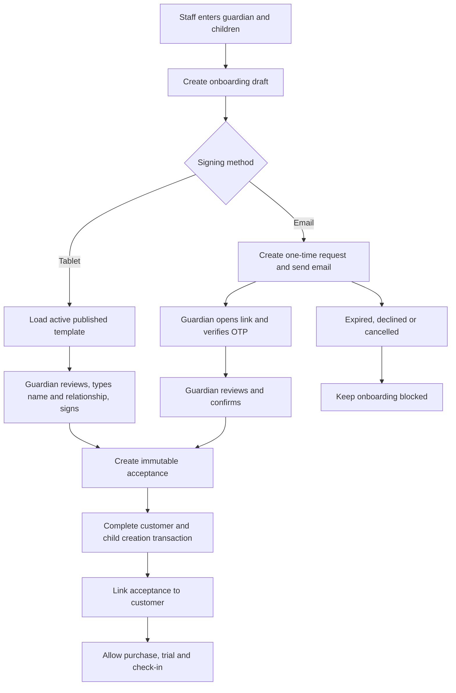

# PlayVille CRM Customer Disclaimer Signing Architecture

## 1. Document purpose

This document is the implementation contract for customer disclaimer/waiver signing in PlayVille CRM. It is written so another coding model or engineer can implement the feature without reconstructing product decisions from chat history.

The solution supports both:

1. `TABLET_SIGNATURE` — the guardian reviews and signs at the branch.
2. `EMAIL_CONFIRMATION` — the guardian receives a secure, expiring link, verifies their contact and confirms remotely.

Phase 1 implements the shared database foundation, versioned disclaimer administration, tablet signing, immutable evidence and backend enforcement. Phase 2 adds email confirmation and OTP using the same model.

This is a product and technical design, not legal advice. PlayVille's legal counsel must approve the disclaimer text, identity-verification standard, retention period, re-signing policy and whether the captured evidence is appropriate for the business use case.

## 2. Product decision

PlayVille will support both signing methods.

- Tablet is the default for a guardian who is physically present.
- Email is the fallback for pre-registration, remote review or an absent guardian.
- A physical visit, trial, check-in or package purchase that permits play must not proceed without a valid acceptance of the disclaimer version required by the branch.
- The email route creates a pending onboarding draft, not a normal active customer.
- Staff cannot mark a disclaimer as signed on behalf of a guardian.
- Published disclaimer content is immutable. Corrections require a new version.
- Check-in enforces consent again, even if the Angular onboarding screen previously allowed progress.

## 3. Current implementation and gaps

Current customer records contain:

- `disclaimer_accepted`
- `disclaimer_version`
- `acceptance_timestamp`

The guided onboarding service blocks physical-purpose onboarding when `disclaimerAccepted` is false. However, the current model does not retain:

- The exact accepted content and cryptographic hash.
- Guardian identity and relationship to the child.
- Signing method.
- Tablet signature evidence.
- Email request, delivery and verification evidence.
- IP address, user agent, branch, device or facilitating staff.
- Immutable acceptance history across disclaimer versions.
- Expiration, decline, supersession or re-signing state.

The direct `POST /customers` endpoint can also create a customer without the guided physical-visit rule. The new design must close that bypass and must not trust a boolean sent by Angular.

## 4. Terminology

| Term | Meaning |
|---|---|
| Template | Versioned disclaimer content configured globally or for a branch |
| Published template | Immutable version available for acceptance |
| Onboarding draft | Temporary guardian and child data awaiting a signature |
| Signing request | One tablet or email attempt against one template version |
| Acceptance | Immutable evidence that a guardian accepted a specific template |
| Current acceptance | Latest valid acceptance satisfying the branch's current policy |
| Evidence hash | SHA-256 hash covering the important acceptance evidence fields |
| Physical-purpose onboarding | Trial, buy-now or any workflow intended to lead to play/check-in |

## 5. Roles and permissions

### Admin

- Create disclaimer drafts.
- Publish a new immutable version.
- Select the active branch template.
- Configure allowed signing methods, link expiry and re-signing behavior.
- View acceptance metadata and signed evidence.
- Retire obsolete templates without modifying their historical content.

### Manager

- Start tablet signing.
- Send or resend an email signing request when enabled.
- View signing status and signed evidence for their branch.
- Cancel an incorrect pending request with a mandatory reason.
- Cannot alter a published template or acceptance evidence.

### Branch staff

- Enter an onboarding draft.
- Start tablet signing.
- Send an email signing request when enabled.
- See pending/signed/expired status.
- Complete onboarding only after valid acceptance.
- Cannot manually toggle consent.

### Guardian/customer

- Review the complete disclaimer.
- Provide name and relationship.
- Sign on tablet or confirm using a secure email flow.
- Receive or download a copy when configured.

## 6. High-level workflow



## 7. State machines

### 7.1 Disclaimer template

```text
DRAFT -> PUBLISHED -> RETIRED
```

Rules:

- Only `DRAFT` content may be edited.
- Publishing calculates and stores the content hash and publisher metadata.
- A published version is never updated in place.
- A retired template remains readable for historical evidence.
- Only one active required template may be selected for a branch at a time.

### 7.2 Onboarding draft

```text
DRAFT -> AWAITING_SIGNATURE -> SIGNED -> COMPLETED
                       |            |
                       +-> EXPIRED  +-> CANCELLED
                       +-> DECLINED
```

Rules:

- `SIGNED` means valid acceptance exists, but customer creation may still be completing.
- `COMPLETED` means customer and children were created and acceptance was linked.
- Expired/cancelled drafts cannot be completed without a new signing request.
- Drafts must have an automatic retention/purge policy.

### 7.3 Signing request

```text
CREATED -> SENT -> OPENED -> VERIFIED -> SIGNED
   |        |       |          |
   +------> FAILED  +--------> EXPIRED
   +------> CANCELLED
   +------> DECLINED
```

Tablet requests normally transition `CREATED -> OPENED -> SIGNED` in the authenticated branch session. Email requests use all states.

### 7.4 Acceptance

Acceptances are immutable. Their operational status may be:

- `VALID`
- `SUPERSEDED` — a newer required version was signed.
- `REVOKED` — only if legal policy permits withdrawal; retain the original record and append revocation metadata.

Never delete an acceptance referenced by a customer, check-in, invoice or audit entry.

## 8. Proposed database migration

Use migration name:

`V29__customer_disclaimer_signing.sql`

The SQL below is the target schema. The implementing model must validate column names against the current schema before applying it.

```sql
CREATE TABLE pv_disclaimer_templates (
    id BIGINT UNSIGNED AUTO_INCREMENT PRIMARY KEY,
    branch_id INT UNSIGNED NULL,
    template_code VARCHAR(50) NOT NULL,
    version VARCHAR(30) NOT NULL,
    language_code VARCHAR(10) NOT NULL DEFAULT 'en',
    title VARCHAR(200) NOT NULL,
    content_html LONGTEXT NOT NULL,
    content_sha256 CHAR(64) NULL,
    status VARCHAR(20) NOT NULL DEFAULT 'DRAFT',
    effective_from DATETIME NULL,
    retired_at DATETIME NULL,
    created_by_staff_id INT UNSIGNED NULL,
    published_by_staff_id INT UNSIGNED NULL,
    created_at DATETIME(6) NOT NULL DEFAULT CURRENT_TIMESTAMP(6),
    published_at DATETIME(6) NULL,
    CONSTRAINT uq_disclaimer_template_version
        UNIQUE (branch_id, template_code, version),
    CONSTRAINT fk_disclaimer_template_branch
        FOREIGN KEY (branch_id) REFERENCES pv_branches(id) ON DELETE RESTRICT,
    CONSTRAINT fk_disclaimer_template_creator
        FOREIGN KEY (created_by_staff_id) REFERENCES pv_staff(id) ON DELETE SET NULL,
    CONSTRAINT fk_disclaimer_template_publisher
        FOREIGN KEY (published_by_staff_id) REFERENCES pv_staff(id) ON DELETE SET NULL,
    CONSTRAINT chk_disclaimer_template_status
        CHECK (status IN ('DRAFT', 'PUBLISHED', 'RETIRED'))
) ENGINE=InnoDB DEFAULT CHARSET=utf8mb4;

ALTER TABLE pv_branches
    ADD COLUMN disclaimer_required_for_physical_visit TINYINT(1) NOT NULL DEFAULT 1,
    ADD COLUMN tablet_signature_enabled TINYINT(1) NOT NULL DEFAULT 1,
    ADD COLUMN email_confirmation_enabled TINYINT(1) NOT NULL DEFAULT 0,
    ADD COLUMN disclaimer_email_link_ttl_hours INT NOT NULL DEFAULT 24,
    ADD COLUMN disclaimer_email_otp_required TINYINT(1) NOT NULL DEFAULT 1,
    ADD COLUMN disclaimer_resign_on_new_version TINYINT(1) NOT NULL DEFAULT 1,
    ADD COLUMN active_disclaimer_template_id BIGINT UNSIGNED NULL,
    ADD CONSTRAINT fk_branch_active_disclaimer_template
        FOREIGN KEY (active_disclaimer_template_id)
        REFERENCES pv_disclaimer_templates(id) ON DELETE RESTRICT;

CREATE TABLE pv_customer_onboarding_drafts (
    id BIGINT UNSIGNED AUTO_INCREMENT PRIMARY KEY,
    branch_id INT UNSIGNED NOT NULL,
    created_by_staff_id INT UNSIGNED NULL,
    parent_name VARCHAR(150) NOT NULL,
    phone_number VARCHAR(15) NOT NULL,
    email VARCHAR(150) NULL,
    lead_source VARCHAR(30) NULL,
    emergency_contact_name VARCHAR(150) NULL,
    emergency_contact_phone VARCHAR(15) NULL,
    marketing_consent TINYINT(1) NOT NULL DEFAULT 0,
    visit_purpose VARCHAR(40) NOT NULL,
    children_json JSON NOT NULL,
    status VARCHAR(30) NOT NULL DEFAULT 'DRAFT',
    idempotency_key VARCHAR(100) NOT NULL,
    expires_at DATETIME(6) NOT NULL,
    completed_customer_id INT UNSIGNED NULL,
    created_at DATETIME(6) NOT NULL DEFAULT CURRENT_TIMESTAMP(6),
    updated_at DATETIME(6) NOT NULL DEFAULT CURRENT_TIMESTAMP(6)
        ON UPDATE CURRENT_TIMESTAMP(6),
    completed_at DATETIME(6) NULL,
    CONSTRAINT uq_onboarding_draft_idempotency
        UNIQUE (branch_id, idempotency_key),
    CONSTRAINT fk_onboarding_draft_branch
        FOREIGN KEY (branch_id) REFERENCES pv_branches(id) ON DELETE RESTRICT,
    CONSTRAINT fk_onboarding_draft_staff
        FOREIGN KEY (created_by_staff_id) REFERENCES pv_staff(id) ON DELETE SET NULL,
    CONSTRAINT fk_onboarding_draft_customer
        FOREIGN KEY (completed_customer_id) REFERENCES pv_customers(id) ON DELETE SET NULL,
    CONSTRAINT chk_onboarding_draft_status
        CHECK (status IN ('DRAFT', 'AWAITING_SIGNATURE', 'SIGNED', 'COMPLETED',
                          'EXPIRED', 'DECLINED', 'CANCELLED'))
) ENGINE=InnoDB DEFAULT CHARSET=utf8mb4;

CREATE INDEX idx_onboarding_draft_branch_status
    ON pv_customer_onboarding_drafts(branch_id, status, created_at);
CREATE INDEX idx_onboarding_draft_expiry
    ON pv_customer_onboarding_drafts(status, expires_at);
CREATE INDEX idx_onboarding_draft_phone
    ON pv_customer_onboarding_drafts(branch_id, phone_number);

CREATE TABLE pv_disclaimer_signing_requests (
    id BIGINT UNSIGNED AUTO_INCREMENT PRIMARY KEY,
    branch_id INT UNSIGNED NOT NULL,
    onboarding_draft_id BIGINT UNSIGNED NOT NULL,
    template_id BIGINT UNSIGNED NOT NULL,
    channel VARCHAR(30) NOT NULL,
    status VARCHAR(20) NOT NULL DEFAULT 'CREATED',
    destination VARCHAR(150) NULL,
    token_sha256 CHAR(64) NULL,
    otp_hash VARCHAR(100) NULL,
    otp_attempts INT NOT NULL DEFAULT 0,
    max_otp_attempts INT NOT NULL DEFAULT 5,
    idempotency_key VARCHAR(100) NOT NULL,
    requested_by_staff_id INT UNSIGNED NULL,
    notification_delivery_id INT UNSIGNED NULL,
    expires_at DATETIME(6) NOT NULL,
    sent_at DATETIME(6) NULL,
    opened_at DATETIME(6) NULL,
    verified_at DATETIME(6) NULL,
    signed_at DATETIME(6) NULL,
    cancelled_at DATETIME(6) NULL,
    cancellation_reason VARCHAR(500) NULL,
    created_at DATETIME(6) NOT NULL DEFAULT CURRENT_TIMESTAMP(6),
    CONSTRAINT uq_disclaimer_request_idempotency
        UNIQUE (branch_id, idempotency_key),
    CONSTRAINT uq_disclaimer_request_token UNIQUE (token_sha256),
    CONSTRAINT fk_disclaimer_request_branch
        FOREIGN KEY (branch_id) REFERENCES pv_branches(id) ON DELETE RESTRICT,
    CONSTRAINT fk_disclaimer_request_draft
        FOREIGN KEY (onboarding_draft_id)
        REFERENCES pv_customer_onboarding_drafts(id) ON DELETE RESTRICT,
    CONSTRAINT fk_disclaimer_request_template
        FOREIGN KEY (template_id) REFERENCES pv_disclaimer_templates(id) ON DELETE RESTRICT,
    CONSTRAINT fk_disclaimer_request_staff
        FOREIGN KEY (requested_by_staff_id) REFERENCES pv_staff(id) ON DELETE SET NULL,
    CONSTRAINT fk_disclaimer_request_delivery
        FOREIGN KEY (notification_delivery_id)
        REFERENCES pv_notification_deliveries(id) ON DELETE SET NULL,
    CONSTRAINT chk_disclaimer_request_channel
        CHECK (channel IN ('TABLET_SIGNATURE', 'EMAIL_CONFIRMATION')),
    CONSTRAINT chk_disclaimer_request_status
        CHECK (status IN ('CREATED', 'SENT', 'OPENED', 'VERIFIED', 'SIGNED',
                          'FAILED', 'EXPIRED', 'DECLINED', 'CANCELLED'))
) ENGINE=InnoDB DEFAULT CHARSET=utf8mb4;

CREATE INDEX idx_disclaimer_request_draft
    ON pv_disclaimer_signing_requests(onboarding_draft_id, created_at);
CREATE INDEX idx_disclaimer_request_expiry
    ON pv_disclaimer_signing_requests(status, expires_at);

CREATE TABLE pv_disclaimer_acceptances (
    id BIGINT UNSIGNED AUTO_INCREMENT PRIMARY KEY,
    branch_id INT UNSIGNED NOT NULL,
    customer_id INT UNSIGNED NULL,
    onboarding_draft_id BIGINT UNSIGNED NOT NULL,
    signing_request_id BIGINT UNSIGNED NOT NULL,
    template_id BIGINT UNSIGNED NOT NULL,
    template_code_snapshot VARCHAR(50) NOT NULL,
    template_version_snapshot VARCHAR(30) NOT NULL,
    template_title_snapshot VARCHAR(200) NOT NULL,
    content_sha256 CHAR(64) NOT NULL,
    acceptance_method VARCHAR(30) NOT NULL,
    signer_name VARCHAR(150) NOT NULL,
    signer_relationship VARCHAR(50) NOT NULL,
    signer_email VARCHAR(150) NULL,
    signer_phone VARCHAR(15) NULL,
    accepted_at DATETIME(6) NOT NULL,
    facilitated_by_staff_id INT UNSIGNED NULL,
    ip_address VARCHAR(64) NULL,
    user_agent VARCHAR(500) NULL,
    device_identifier VARCHAR(100) NULL,
    signature_mime_type VARCHAR(50) NULL,
    signature_image MEDIUMBLOB NULL,
    signature_sha256 CHAR(64) NULL,
    evidence_sha256 CHAR(64) NOT NULL,
    status VARCHAR(20) NOT NULL DEFAULT 'VALID',
    superseded_by_acceptance_id BIGINT UNSIGNED NULL,
    revoked_at DATETIME(6) NULL,
    revoked_by_staff_id INT UNSIGNED NULL,
    revocation_reason VARCHAR(500) NULL,
    created_at DATETIME(6) NOT NULL DEFAULT CURRENT_TIMESTAMP(6),
    CONSTRAINT uq_disclaimer_acceptance_request UNIQUE (signing_request_id),
    CONSTRAINT fk_disclaimer_acceptance_branch
        FOREIGN KEY (branch_id) REFERENCES pv_branches(id) ON DELETE RESTRICT,
    CONSTRAINT fk_disclaimer_acceptance_customer
        FOREIGN KEY (customer_id) REFERENCES pv_customers(id) ON DELETE RESTRICT,
    CONSTRAINT fk_disclaimer_acceptance_draft
        FOREIGN KEY (onboarding_draft_id)
        REFERENCES pv_customer_onboarding_drafts(id) ON DELETE RESTRICT,
    CONSTRAINT fk_disclaimer_acceptance_request
        FOREIGN KEY (signing_request_id)
        REFERENCES pv_disclaimer_signing_requests(id) ON DELETE RESTRICT,
    CONSTRAINT fk_disclaimer_acceptance_template
        FOREIGN KEY (template_id) REFERENCES pv_disclaimer_templates(id) ON DELETE RESTRICT,
    CONSTRAINT fk_disclaimer_acceptance_staff
        FOREIGN KEY (facilitated_by_staff_id) REFERENCES pv_staff(id) ON DELETE SET NULL,
    CONSTRAINT fk_disclaimer_acceptance_superseded
        FOREIGN KEY (superseded_by_acceptance_id)
        REFERENCES pv_disclaimer_acceptances(id) ON DELETE RESTRICT,
    CONSTRAINT fk_disclaimer_acceptance_revoker
        FOREIGN KEY (revoked_by_staff_id) REFERENCES pv_staff(id) ON DELETE SET NULL,
    CONSTRAINT chk_disclaimer_acceptance_method
        CHECK (acceptance_method IN ('TABLET_SIGNATURE', 'EMAIL_CONFIRMATION')),
    CONSTRAINT chk_disclaimer_acceptance_status
        CHECK (status IN ('VALID', 'SUPERSEDED', 'REVOKED'))
) ENGINE=InnoDB DEFAULT CHARSET=utf8mb4;

CREATE INDEX idx_disclaimer_acceptance_customer
    ON pv_disclaimer_acceptances(customer_id, status, accepted_at);
CREATE INDEX idx_disclaimer_acceptance_draft
    ON pv_disclaimer_acceptances(onboarding_draft_id);

ALTER TABLE pv_customers
    ADD COLUMN current_disclaimer_acceptance_id BIGINT UNSIGNED NULL,
    ADD CONSTRAINT fk_customer_current_disclaimer_acceptance
        FOREIGN KEY (current_disclaimer_acceptance_id)
        REFERENCES pv_disclaimer_acceptances(id) ON DELETE RESTRICT;
```

### 8.1 Migration compatibility notes

- Existing `disclaimer_accepted`, `disclaimer_version` and `acceptance_timestamp` columns remain temporarily for backwards compatibility.
- Do not create fake acceptance evidence for legacy booleans. Represent them as `LEGACY_ACCEPTANCE_UNVERIFIED` in API responses until the customer signs a current template.
- New code reads `current_disclaimer_acceptance_id` as the authoritative source.
- Remove legacy columns only in a later migration after all relevant customers have re-signed.
- MySQL `CHECK` enforcement depends on the deployed MySQL version. Service-layer validation remains mandatory.
- `children_json` is a temporary draft snapshot. Validate it against DTOs before customer creation and protect database backups because it contains child data.

## 9. Evidence hashing

### 9.1 Template hash

On publish:

1. Normalize line endings to `\n`.
2. Encode normalized HTML as UTF-8.
3. Calculate lowercase hexadecimal SHA-256.
4. Store `content_sha256` once.
5. Reject further content updates while status is `PUBLISHED` or `RETIRED`.

### 9.2 Signature hash

For tablet signing:

- Decode the submitted PNG data.
- Validate MIME type, file signature, dimensions and maximum bytes.
- Re-encode server-side to a canonical PNG if practical.
- Calculate SHA-256 over stored bytes.
- Never trust a hash submitted by Angular.

### 9.3 Evidence hash

Build a deterministic UTF-8 canonical representation containing at least:

```text
acceptanceMethod
branchId
onboardingDraftId
signingRequestId
templateId
templateVersion
contentSha256
signerName
signerRelationship
signerEmail
signerPhone
acceptedAt in UTC ISO-8601
signatureSha256 or EMAIL_CONFIRMATION
```

Hash this canonical value server-side and store it as `evidence_sha256`.

## 10. Backend architecture

### 10.1 Suggested packages

```text
com.playville.crm.disclaimer
  controller/
    DisclaimerTemplateController
    DisclaimerSigningController
    PublicDisclaimerController          # Phase 2
  dto/
    template/
    signing/
    publicsigning/
  entity/
    DisclaimerTemplate
    CustomerOnboardingDraft
    DisclaimerSigningRequest
    DisclaimerAcceptance
  repository/
  service/
    DisclaimerTemplateService
    DisclaimerSigningService
    DisclaimerEvidenceService
    DisclaimerPolicyService
    DisclaimerEmailService              # Phase 2
```

Follow the existing application package convention if moving these classes under the current `entity`, `repository`, `service` and `controller` packages is preferred. Keep the domain responsibilities separate even if packages remain flat.

### 10.2 Core service responsibilities

#### DisclaimerTemplateService

- Create and edit drafts.
- Publish immutable templates.
- Calculate template hash.
- Retire templates.
- Assign active template to the current branch.
- Prevent active selection of a draft or foreign-branch template.

#### DisclaimerSigningService

- Create onboarding drafts.
- Start tablet signing requests.
- Create email signing requests in Phase 2.
- Validate request status and expiry.
- Record acceptance atomically and idempotently.
- Complete customer onboarding from a signed draft.
- Link acceptance to the newly created customer.

#### DisclaimerPolicyService

Provide one authoritative method:

```java
DisclaimerEligibility evaluate(Customer customer, Branch branch, PhysicalAction action)
```

Possible reason codes:

- `DISCLAIMER_NOT_REQUIRED`
- `NO_ACTIVE_TEMPLATE`
- `DISCLAIMER_NOT_SIGNED`
- `DISCLAIMER_VERSION_OUTDATED`
- `DISCLAIMER_REVOKED`
- `DISCLAIMER_VALID`

Enforcement uses this service from onboarding, check-in, trial issuance and any physical booking entry point.

#### DisclaimerEvidenceService

- Sanitize signature input.
- Calculate content, signature and evidence hashes.
- Generate a signed evidence PDF for viewing/download.
- Exclude sensitive binary data from ordinary list responses and logs.

## 11. API contract

All staff endpoints require JWT authentication and branch scope. All write endpoints require an `Idempotency-Key` where retry could duplicate a draft, request or acceptance.

### 11.1 Template administration

| Method | Endpoint | Role | Purpose |
|---|---|---|---|
| `GET` | `/disclaimer-templates` | admin/manager | List branch/global templates |
| `GET` | `/disclaimer-templates/{id}` | admin/manager | View template metadata/content |
| `POST` | `/disclaimer-templates` | admin | Create draft |
| `PUT` | `/disclaimer-templates/{id}` | admin | Edit draft only |
| `POST` | `/disclaimer-templates/{id}/publish` | admin | Hash and publish immutable version |
| `POST` | `/disclaimer-templates/{id}/retire` | admin | Retire version |
| `PUT` | `/branches/current/disclaimer-settings` | admin | Configure branch policy and active template |

### 11.2 Staff onboarding and tablet signing

| Method | Endpoint | Purpose |
|---|---|---|
| `POST` | `/customer-onboarding/drafts` | Save pending guardian/children data |
| `GET` | `/customer-onboarding/drafts/{id}` | Load branch-owned draft and status |
| `POST` | `/customer-onboarding/drafts/{id}/tablet-request` | Start tablet signing against active template |
| `GET` | `/disclaimer-signing-requests/{id}/tablet-view` | Return exact published content and masked draft identity |
| `POST` | `/disclaimer-signing-requests/{id}/tablet-acceptance` | Submit typed identity, relationship, confirmation and signature |
| `POST` | `/customer-onboarding/drafts/{id}/complete` | Create customer/kids after signed acceptance |
| `POST` | `/customer-onboarding/drafts/{id}/cancel` | Cancel pending draft with reason |

Example tablet acceptance request:

```json
{
  "signerName": "Nikhil Kumar",
  "signerRelationship": "FATHER",
  "confirmedReadAndAccepted": true,
  "signatureDataUrl": "data:image/png;base64,...",
  "deviceIdentifier": "whitefield-frontdesk-tablet-1"
}
```

The server must ignore any submitted template version/hash and obtain these from the signing request.

### 11.3 Customer evidence

| Method | Endpoint | Purpose |
|---|---|---|
| `GET` | `/customers/{id}/disclaimer-status` | Current eligibility and reason |
| `GET` | `/customers/{id}/disclaimer-acceptances` | Acceptance history without raw signature bytes |
| `GET` | `/customers/{id}/disclaimer-acceptances/{acceptanceId}/document` | Signed evidence PDF |

### 11.4 Phase 2 public email APIs

Add only these public routes to `SecurityConfig`:

```text
GET  /public/disclaimer/{rawToken}
POST /public/disclaimer/{rawToken}/otp/send
POST /public/disclaimer/{rawToken}/otp/verify
POST /public/disclaimer/{rawToken}/accept
POST /public/disclaimer/{rawToken}/decline
```

Public endpoints derive branch and draft from the hashed token. They must never trust a branch ID, customer ID, template ID or email supplied by the browser.

## 12. Tablet user experience — Phase 1

### 12.1 Staff onboarding screen

Replace the current `I confirm the customer disclaimer` checkbox with a dedicated step:

```text
4. Guardian disclaimer

Status: Not signed
[ Sign on this tablet ]
[ Send secure email link ]   # disabled with “Coming in Phase 2” initially

Customer onboarding and check-in remain locked until signing succeeds.
```

The staff first saves an onboarding draft. The UI then opens tablet signing in a distraction-free full-screen route.

### 12.2 Tablet signing screen

Route suggestion:

`/sign/disclaimer/tablet/:requestId`

Requirements:

- Hide the admin sidebar and unrelated customer information.
- Show PlayVille and branch identity.
- Show template title and version.
- Render sanitized published HTML.
- Require the guardian to scroll/read the content before enabling final confirmation if counsel approves this control.
- Require typed guardian name.
- Require relationship selection: mother, father, legal guardian, other.
- Require explicit `I have read and agree` confirmation.
- Capture signature using pointer events on canvas; support touch, stylus and mouse.
- Provide Clear and Undo/Reset actions.
- Disable submission until signature has meaningful ink, not only a blank canvas.
- Show a confirmation summary before final submit.
- After success, return to onboarding with `Signed`, method, guardian, version and timestamp.
- Do not store the signature in local storage.

### 12.3 Signature canvas requirements

- Use pointer events rather than separate mouse/touch implementations.
- Account for device pixel ratio so the signature is not blurry.
- Resize responsively without clearing existing strokes unexpectedly.
- Record only the rendered canonical PNG, not raw high-frequency pointer telemetry.
- Maximum encoded upload target: 500 KB.
- Minimum non-transparent bounding-box area or stroke count to reject empty/dot-only signatures.
- Canvas is supporting evidence, not the only evidence.

## 13. Email confirmation user experience — Phase 2

### 13.1 Staff flow

1. Customer email is mandatory and validated.
2. Staff selects `Send secure email link`.
3. Server creates a 256-bit random token, stores only SHA-256, and sends the raw token once.
4. UI displays destination, sent time and expiry.
5. Available actions: resend, cancel, switch to tablet.
6. Resending invalidates or supersedes the previous active token according to service policy.

### 13.2 Guardian flow

1. Open secure HTTPS link.
2. See masked phone/email and branch identity.
3. Request/enter OTP when branch policy requires it.
4. Review the exact template.
5. Enter guardian name and relationship.
6. Confirm acceptance.
7. Receive success page and optional PDF/email copy.

Email acceptance does not require a drawn signature unless legal counsel specifically requires one. Verified identity, exact content/version, explicit action and an immutable evidence trail are more important than drawing with a mouse.

### 13.3 Email security

- Use `SecureRandom` with at least 256 bits of entropy.
- Store only `SHA-256(rawToken)`.
- Default expiry: 24 hours, branch configurable within safe limits such as 1–72 hours.
- One-time token; reject reuse after signing/cancellation/expiry.
- Rate-limit token lookup and OTP endpoints.
- OTP expiry: approximately 5–10 minutes.
- Maximum OTP attempts: 5, then lock request.
- Never reveal whether an arbitrary email is registered.
- Never place guardian/child PII in URL query parameters.
- Avoid logging raw token, OTP, signature or disclaimer body.
- All public signing pages require HTTPS outside local development.

## 14. Onboarding transaction boundaries

### Tablet path

1. Create draft transaction.
2. Create tablet signing request transaction.
3. Create acceptance and mark draft `SIGNED` in one transaction.
4. Complete onboarding in one transaction:
   - Lock draft.
   - Confirm draft `SIGNED` and not expired.
   - Confirm acceptance `VALID`, correct branch and current required template.
   - Recheck duplicate phone.
   - Create customer.
   - Create children.
   - Issue trial entitlement when requested.
   - Link acceptance to customer.
   - Set `customer.current_disclaimer_acceptance_id`.
   - Mark draft `COMPLETED`.
   - Record audit event.

If any completion step fails, customer, children, entitlement and draft completion must roll back together. The acceptance remains valid against the signed draft and completion may be safely retried with the same idempotency key.

### Email path

The same completion transaction runs after email acceptance. The public acceptance endpoint should mark the draft signed but should not necessarily create the customer in the anonymous request. Preferred behavior is:

- Public acceptance marks `SIGNED`.
- Staff UI receives updated status by refresh/polling.
- Authenticated staff completes onboarding.

This prevents an anonymous endpoint from executing the full privileged onboarding workflow.

## 15. Enforcement matrix

| Operation | Enforcement |
|---|---|
| Save onboarding draft | Signature not required |
| Complete enquiry-only draft | Branch policy may allow without signature |
| Complete physical-purpose onboarding | Current valid acceptance required |
| Issue complimentary trial | Current valid acceptance required |
| Buy package for imminent physical visit | Current valid acceptance required when branch policy says so |
| Check-in | Always re-evaluate branch disclaimer policy |
| Add child to existing customer | Does not itself require re-signing unless policy/template changed |
| New active disclaimer version | Existing customers become re-sign-required when configured |
| Invoice/payment | Do not use disclaimer as payment consent; separate concerns |

The backend is authoritative. Angular guards and disabled buttons are usability aids only.

## 16. Re-signing behavior

When `disclaimer_resign_on_new_version` is enabled:

1. Admin publishes and activates a new template.
2. Existing acceptances remain immutable and historical.
3. `DisclaimerPolicyService` compares acceptance template ID/hash with the active required template.
4. Customer status becomes `RE_SIGNATURE_REQUIRED` without rewriting the customer.
5. Check-in is blocked until a new acceptance is recorded.
6. New acceptance becomes current; prior valid acceptance is marked `SUPERSEDED` and links to the new acceptance.

Do not bulk-update every customer when a template changes. Derive eligibility from active template plus current acceptance, optionally cache/report asynchronously.

## 17. Branch settings

Add a `Customer disclaimer` section to Branch Settings with:

- Required for physical visits.
- Active published template.
- Tablet signing enabled.
- Email confirmation enabled.
- Email OTP required.
- Email link expiry hours.
- Re-sign when a new version becomes active.
- Preview active disclaimer.

Validation:

- Required policy cannot be enabled without an active published template.
- At least one signing method must be enabled when disclaimer is required.
- Email confirmation requires branch email sharing configuration and a sender address.
- Link TTL must stay inside server-defined limits.
- Template must be global or belong to the branch.

## 18. Notification integration — Phase 2

Reuse the configured `JavaMailSender` and branch email identity, but implement a dedicated `DisclaimerEmailService`; do not couple disclaimer delivery to `InvoiceNotificationService`.

Extend `pv_notification_deliveries` in a later migration with nullable `disclaimer_signing_request_id`, or introduce a generic `reference_type/reference_id` model. The chosen migration must preserve existing invoice delivery behavior.

Email content includes:

- PlayVille/branch identity.
- Guardian name.
- Clear purpose of the request.
- Expiration time in branch timezone.
- One secure call-to-action link.
- Statement that the link should not be forwarded.
- Support/contact details.

Do not include child medical/special notes or the full child profile in email.

## 19. Audit events

Record explicit domain audit events in addition to the generic HTTP audit filter:

- `DISCLAIMER_TEMPLATE_CREATED`
- `DISCLAIMER_TEMPLATE_PUBLISHED`
- `DISCLAIMER_TEMPLATE_RETIRED`
- `DISCLAIMER_POLICY_UPDATED`
- `ONBOARDING_DRAFT_CREATED`
- `DISCLAIMER_TABLET_STARTED`
- `DISCLAIMER_EMAIL_SENT`
- `DISCLAIMER_EMAIL_OPENED`
- `DISCLAIMER_OTP_VERIFIED`
- `DISCLAIMER_SIGNED`
- `DISCLAIMER_REQUEST_EXPIRED`
- `DISCLAIMER_REQUEST_DECLINED`
- `DISCLAIMER_REQUEST_CANCELLED`
- `DISCLAIMER_ACCEPTANCE_SUPERSEDED`
- `DISCLAIMER_ACCEPTANCE_REVOKED`
- `ONBOARDING_COMPLETED`
- `PHYSICAL_ACTION_BLOCKED_NO_DISCLAIMER`

Audit metadata may include IDs, template version, method and outcome. It must not include signature bytes, raw tokens, OTPs or full disclaimer HTML.

## 20. Privacy, retention and data protection

- Signature images are sensitive personal evidence. Restrict retrieval to authorized roles and audited endpoints.
- Encrypt database volumes and backups.
- Do not return signature blobs in customer list/detail APIs.
- Generate signed documents only through authorized branch-scoped endpoints.
- Define a legal retention schedule with counsel. Do not simply purge acceptance evidence when a customer becomes inactive.
- Purge expired onboarding drafts that never became customers after the approved short retention period.
- Separate marketing consent from operational disclaimer acceptance.
- Never preselect acceptance or marketing consent.
- Ensure exported signed PDFs display the exact template version/hash and evidence metadata.

## 21. Failure handling

| Failure | Expected behavior |
|---|---|
| No published active template | Block physical onboarding with admin-action message |
| Empty/invalid tablet signature | Keep request open and show validation |
| Duplicate submit | Return original acceptance using idempotency |
| Customer phone created concurrently | Keep signed draft; report duplicate and allow authorized merge/review workflow |
| Email delivery failure | Request `FAILED`; allow retry with a new idempotency key |
| Email link expired | Block acceptance; allow staff resend or tablet switch |
| OTP attempts exceeded | Lock request; staff must create replacement request |
| Template retired after request started | Reject signing unless request policy explicitly pins a still-valid version; preferred rule is reject and issue current version |
| Customer signed older active version then admin switches template | Apply configured re-sign policy at check-in |
| Signature stored but onboarding fails | Keep acceptance/draft signed and safely retry completion |

## 22. Phase 1 implementation scope

Phase 1 must deliver:

1. `V29__customer_disclaimer_signing.sql` migration.
2. Entities, repositories and DTOs for templates, drafts, signing requests and acceptances.
3. Admin template CRUD for drafts, publish and retire operations.
4. Branch disclaimer settings and active template selection.
5. Onboarding draft creation.
6. Tablet signing request and full-screen tablet UI.
7. Signature validation and evidence hashing.
8. Atomic onboarding completion from a signed draft.
9. Customer disclaimer status/history UI.
10. Backend gate on physical onboarding, trial issuance and check-in.
11. Audit events.
12. Automated backend and Angular tests.
13. Migration of the current onboarding checkbox UI to the new signing step.

Phase 1 explicitly excludes:

- Public email signing pages.
- OTP provider integration.
- Email send/resend.
- WhatsApp signing links.
- Customer self-service portal signing.
- External qualified e-sign provider integration.

## 23. Phase 1 suggested implementation order

### Step 1 — Database and domain

- Add migration.
- Add enums, entities and repositories.
- Add repository queries with branch/status locking.
- Add migration test against existing schema.

### Step 2 — Templates and branch policy

- Implement template draft/publish/retire service.
- Add branch policy DTOs/endpoints.
- Add admin UI and validation.
- Seed one draft only in development if required; production publishing is an explicit admin action.

### Step 3 — Draft onboarding

- Split current onboarding into draft creation and completion.
- Preserve existing idempotency behavior.
- Remove trust in `disclaimerAccepted` request boolean.

### Step 4 — Tablet signing

- Add signing request endpoint.
- Add tablet view DTO.
- Build canvas/signature UI.
- Validate and persist acceptance evidence.

### Step 5 — Completion and enforcement

- Complete customer/kid/trial creation from signed draft.
- Link acceptance to customer.
- Gate check-in and trial issuance through `DisclaimerPolicyService`.

### Step 6 — Evidence and audit

- Add acceptance history/status APIs.
- Add signed evidence PDF.
- Add domain audit events.

### Step 7 — Verification

- Backend unit/integration tests.
- Angular component/service tests.
- Manual tablet tests on touch, stylus and mouse.
- Branch isolation and authorization tests.

## 24. Phase 2 implementation scope

1. Email request creation and idempotent delivery.
2. Public token lookup endpoint.
3. OTP send/verify and rate limiting.
4. Public responsive disclaimer review/confirmation page.
5. Request polling/status refresh in staff onboarding UI.
6. Resend, cancel and switch-to-tablet actions.
7. Expiration scheduler.
8. Confirmation email/PDF copy.
9. Delivery and public-flow audit events.
10. Penetration/security testing of public token endpoints.

## 25. Backend acceptance criteria — Phase 1

- Published disclaimer content cannot be edited.
- Publishing produces a deterministic SHA-256 content hash.
- A branch cannot require disclaimers without selecting a published template.
- A tablet request is branch-scoped and pins one published template.
- Empty or malformed signature data is rejected.
- The server calculates all hashes and timestamps.
- Reusing an acceptance idempotency key does not create a second acceptance.
- Customer onboarding cannot complete without a valid signed acceptance for physical-purpose workflows.
- Direct customer APIs cannot fabricate acceptance using a boolean.
- Check-in rejects customers missing the branch-required current acceptance.
- Existing historical acceptances remain readable after template retirement.
- Signature bytes are absent from list and standard customer detail responses.
- Cross-branch template, draft, request and acceptance access is rejected.
- Customer/kid/trial creation rolls back together on failure.
- Audit records never contain signature bytes or raw security tokens.

## 26. Angular acceptance criteria — Phase 1

- The existing waiver checkbox is removed from physical onboarding.
- Staff sees clear `Not signed`, `Signing`, `Signed`, `Expired` and `Blocked` states.
- Tablet signing launches in a distraction-free responsive screen.
- Disclaimer content is readable on phone, tablet, laptop and desktop.
- Signature canvas supports touch, stylus and mouse.
- Clear/reset works without leaving stale hidden signature data.
- Submit remains disabled until identity, relationship, confirmation and meaningful signature are present.
- Double-clicking submit cannot create duplicate acceptance.
- Successful signing returns to the same onboarding draft.
- Onboarding completion remains disabled until the backend reports valid acceptance.
- Customer Detail shows current version, method, signer and signed timestamp.
- Admin can create a draft template, publish it and assign it to the branch.
- Error messages are actionable and shown near the relevant action.

## 27. Required automated tests

### Backend

- Template draft may be edited; published template may not.
- Template hash is stable for normalized identical content.
- Foreign branch cannot publish/select template.
- Tablet request requires enabled policy and active template.
- Acceptance rejects expired/cancelled/already-signed request.
- Acceptance rejects blank image, wrong MIME, oversize image and empty canvas.
- Duplicate idempotency key replays original response.
- Physical onboarding fails without acceptance.
- Physical onboarding succeeds with matching valid acceptance.
- Enquiry-only behavior follows branch policy.
- Check-in fails for missing/outdated/revoked acceptance.
- Re-signing supersedes prior acceptance without deleting it.
- Transaction rollback does not leave partially created children/entitlements.
- Acceptance PDF is branch-scoped.

### Angular

- Draft save retains entered guardian/child data.
- Tablet method starts correct request.
- Signature controls validate required fields.
- Canvas pointer events produce non-empty PNG.
- Clear resets validation.
- Completion button follows server acceptance state, not a local boolean.
- Retry does not create duplicate draft/request/acceptance.
- Customer detail renders current and historical consent status.

## 28. API error codes

Use stable machine-readable codes with human-readable messages:

- `DISCLAIMER_CONFIGURATION_REQUIRED`
- `DISCLAIMER_TEMPLATE_NOT_PUBLISHED`
- `DISCLAIMER_TEMPLATE_IMMUTABLE`
- `DISCLAIMER_REQUIRED`
- `DISCLAIMER_OUTDATED`
- `DISCLAIMER_REQUEST_EXPIRED`
- `DISCLAIMER_REQUEST_NOT_SIGNABLE`
- `DISCLAIMER_SIGNATURE_REQUIRED`
- `DISCLAIMER_SIGNATURE_INVALID`
- `DISCLAIMER_IDENTITY_REQUIRED`
- `DISCLAIMER_ALREADY_SIGNED`
- `DISCLAIMER_EMAIL_REQUIRED`
- `DISCLAIMER_OTP_INVALID`
- `DISCLAIMER_OTP_LOCKED`
- `ONBOARDING_DRAFT_EXPIRED`
- `ONBOARDING_SIGNATURE_REQUIRED`
- `ONBOARDING_ALREADY_COMPLETED`

## 29. Observability

Track metrics without PII:

- Drafts created.
- Tablet/email signing requests created.
- Signing completion rate by method and branch.
- Median time from draft to signature.
- Expiration/failure rate.
- Onboarding blocks caused by missing/outdated disclaimer.
- Email delivery/OTP failure rate in Phase 2.

Logs use correlation IDs and entity IDs. Never log raw token, OTP, signature, child details or full disclaimer body.

## 30. Definition of done

Phase 1 is complete only when:

- A branch admin can publish and activate a disclaimer.
- Staff can create an onboarding draft and hand the tablet to a guardian.
- The guardian can read, identify themselves and sign.
- PlayVille retains immutable versioned evidence and can generate a readable signed record.
- Customer and children are created only after successful signing.
- Trial/check-in cannot bypass the consent gate.
- Branch isolation, idempotency, audit and automated acceptance criteria pass.
- Existing customer/check-in functionality still works for branches where disclaimer enforcement is deliberately disabled.

Phase 2 is complete only when the same acceptance model works through a secure expiring email + OTP path, with delivery evidence and no anonymous onboarding privilege escalation.

